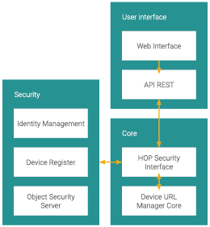
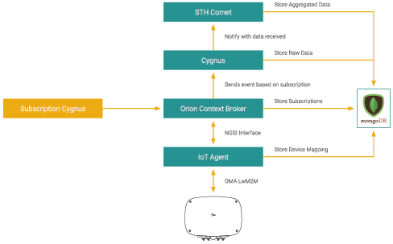

Smart Spot - Development Guide
==============================

Homard API REST
###############
Homard offers in top of the OMA LwM2M server a RESTFul services such as mechanism to communicate with the OMA LwM2M server. This HTTP/HTTPS API RESTFul allows users to manage connected devices connected to the server.

Homard shows connected devices, and manages each of them. Inherit from OMA, the devices expose a set of objects/resources, which can contain one or more instances, and each instance, contains the final resources. Some objects allow multiple instances (such as a Digital I/O Object, which represents the different digital inputs and outputs from the Smart Spot, which can be used to control relays, read external added digital sensors etc.) and others only one instance (such as Device Object). Numbers are used to identify the tuple (Object ID / Instance ID / Resource ID).

There are two API types: Synchronous and Asynchronous:

* **Synchronous API** provides the data as part of the reply to a request in near-real time; it is used mainly for data which is available in Homard platform internally. Therefore, non-external delays are introduced and a very fast reply can be offered.

* **Asynchronous API** is required mainly for the data coming from the sensors (i.e. Smart Spot); since the value will be available when the Smart Spot replies to the request to Homard; delays can be introduced due to issues such as communication latency (GPRS, WiFi etc. latency), sensors reading time (specially sensors such as air quality which includes a processing time of few seconds), and finally due to duty cycle from the Smart Spot in order to optimize energy (battery or solar panels powered). For that reason, Asynchronous API will requires a callback address to inform when the value is available.

Information returned by the API is encapsulated into a JSON data structure, since is the best way to communicate with high level applications (commonly developed in Java, JavaScript and Android).

More info in: https://homard.hopu.eu/indexPage/wiki.html

+------------------------------------------------------------------------------+------------+---------------------------------------------------------------------------------------------------------------------------------------------------------------------------------------------------------+-------------------------------------------+
|HTTP PATH                                                                     |Method      |Description                                                                                                                                                                                              |Result                                     |
+==============================================================================+============+=========================================================================================================================================================================================================+===========================================+
|/api/rest                                                                     |GET         |Returns all OMA clients connected to HOMARD                                                                                                                                                              |[{client1},{client2},...{clientN}]         |
+------------------------------------------------------------------------------+------------+---------------------------------------------------------------------------------------------------------------------------------------------------------------------------------------------------------+-------------------------------------------+
|/api/rest/{endpoint_id}                                                       |GET         |Returns the client description for a {endpoint_id}                                                                                                                                                       |{client}                                   |
+------------------------------------------------------------------------------+------------+---------------------------------------------------------------------------------------------------------------------------------------------------------------------------------------------------------+-------------------------------------------+
|/api/rest/{endpoint_id}/{resource}?proto={https|http}&cburl={DESTINATION_URL} |GET         |Returns resource {resource} from client {endpoint_id} to destination callback URL                                                                                                                        |[{resource1},{resource2},...,{resourceN}]  |
+------------------------------------------------------------------------------+------------+---------------------------------------------------------------------------------------------------------------------------------------------------------------------------------------------------------+-------------------------------------------+
|/api/rest/{endpoint_id}/{resource}?proto={http|https}&cburl={DESTINATION_URL} |PUT         |Changes value of the resource {resource} on client {endpoint_id}. Content type need to be application/JSON and in the request body {“id”: 2, “value”: new_value}                                         |                                           |
+------------------------------------------------------------------------------+------------+---------------------------------------------------------------------------------------------------------------------------------------------------------------------------------------------------------+-------------------------------------------+
|/api/rest/{endpoint_id}/{resource}/co (Requires POST JSON payload)            |POST        |Sets observe on the resource {resource} and, when the resource value is between ‘cbmin’ and ‘cbmax’, posts its value on ‘URL’. Note that if cbmin and cbmax are omitted then all values will be tracked. |                                           |
+------------------------------------------------------------------------------+------------+---------------------------------------------------------------------------------------------------------------------------------------------------------------------------------------------------------+-------------------------------------------+
|/api/rest/{endpoint_id}/{resource}/observe                                    |DELETE      |Stops the monitoring on resource {resource}                                                                                                                                                              |                                           |
+------------------------------------------------------------------------------+------------+---------------------------------------------------------------------------------------------------------------------------------------------------------------------------------------------------------+-------------------------------------------+

API-RESTFul
***********
There are two API types synchronous and asynchronous, on one hand it is synchronous API, that corresponds with Server request such as get the client list, get a client specific data or list the observes set on a device. On the other hand it is device request. The device requests are launched on background, this means that the response will send to a callback URL defined by the client. This API requires the HTTP basic authentication using a Homard account.

The following diagram shows the differences between synchronous and asynchronous API.

.. image:: nstatic/homard-apiRestful-diagram.png
        :width: 527px
        :align: center
        :height: 174px
        :alt: Homard API RESTFul Diagram
        :target: #

This subsection will present the synchronous API and an example. The available synchronous API resources are as follows:

+-------------+---------------------------------------------------+---------------------------------------------------------------+
|HTTP METHOD  |Path                                               |Description                                                    |
+=============+===================================================+===============================================================+
|GET          |/api/rest/                                         |Lists all connected clients with their current data            |
+-------------+---------------------------------------------------+---------------------------------------------------------------+
|GET          |/api/rest/{endpoint_id}                            |Get specific connected client data                             |
+-------------+---------------------------------------------------+---------------------------------------------------------------+
|GET          |/api/rest/cached/{endpoint_id}/{resource}          |Read the resource cached value (last value)                    |
+-------------+---------------------------------------------------+---------------------------------------------------------------+
|GET          |/api/rest/{endpoint_id}/co                         |List client observes                                           |
+-------------+---------------------------------------------------+---------------------------------------------------------------+
|POST         |/api/rest/{endpoint_id}/{resource}/observe         |Observes the selected resource and updates the internal cache. |
+-------------+---------------------------------------------------+---------------------------------------------------------------+
|DELETE       |/api/rest/{endpoint_id}/{resource_path}/observe    |Removes selected client observer                               |
+-------------+---------------------------------------------------+---------------------------------------------------------------+
|DELETE       | /api/rest/{endpoint_id}/{resource_path}/co/{coID} |Removes selected client composite observer                     |
+-------------+---------------------------------------------------+---------------------------------------------------------------+

Cached Synchronous RESTFul API
******************************
Synchronous APIs are for requests which are directly resolved by Homard Server. Thereby, we get the last values cached on the server directly, without any delay. At this way, Homard can be seen as a data broker.

+-------------+--------------------------------------------+-----------+----------------------------------------------------+
|HTTP METHOD  |Path                                        |Parameters |Description                                         |
+=============+============================================+===========+====================================================+
|GET          |/api/rest /cached /{endpoint_id}/{resource} |None       |Read the resource cached value                      |
+-------------+--------------------------------------------+-----------+----------------------------------------------------+

The API is very useful in special for applications that can not setup a HTTP server in its architecture. This synchronous API can be outdated, to solve it, the user can enable a simple observer, which constantly updates the resource. In order to create an internal observer to maintain the value updated for a specific resource is as follows:

+-------------+--------------------------------------------+-----------+--------------------------------------------------------------+
|HTTP METHOD  |Path                                        |Parameters |Description                                                   |
+=============+============================================+===========+==============================================================+
|POST         |/api/rest /{endpoint_id}/{resource}/observe |None       |Observes the selected resource and updates the internal cache |
+-------------+--------------------------------------------+-----------+--------------------------------------------------------------+

Asynchronous RESTFul API
************************
This subsection present the asynchronous API and an execution example. The available asynchronous API resources are as follows:

+-------------+--------------------------------------------+------------------------------------------------+-------------------------------------------------------------------+
|HTTP METHOD  |Path                                        |Parameters                                      |Description                                                        |
+=============+============================================+================================================+===================================================================+
|GET          |/api/rest/{endpoint_id}/{resource}          |* **cburl:** Destination callback url           |Read the value and returns it to the destination callback url      |
|             |                                            |* **proto:** Destination callback url protocol  |                                                                   |
+-------------+--------------------------------------------+------------------------------------------------+-------------------------------------------------------------------+
|PUT          |/api/rest/{endpoint_id}/{resource}          |* **cburl:** Destination callback url           |Write the value on resource and returns the status to callback url |
|             |                                            |* **proto:** Destination callback url protocol  |                                                                   |
+-------------+--------------------------------------------+------------------------------------------------+-------------------------------------------------------------------+

Historical Data RESTFul API
***************************
Homard offers in top of the OMA LwM2M server a RESTFul services such as mechanism to communicate with the OMA LwM2M server. This HTTP/HTTPS RESTFul API allow users to query the stored information such as temperature and humidity. In addition, sensor status and maintenance parameters can be queried in order to know if there are any problem with network connectivity.

+--------------------------------------------------------------------------------------------------------------------------+------------+-----------------------------------------------------------------------------------------+-------------------------------------------------------------------------------------------------------------------------------------------------------------------------------------+
|HTTP PATH                                                                                                                 |Method      |Description                                                                              |Result                                                                                                                                                                               |
+==========================================================================================================================+============+=========================================================================================+=====================================================================================================================================================================================+
|/api/hist                                                                                                                 |GET         |Returns historic of OMA clients connected to HOMARD.                                     |[ { “name”: “HOPf4b85eab98de”, “cn”: “HopCore2” }, { “name”: “HOPf4b85eab98d6”, “cn”: “HopCore9” } ]                                                                                 |
+--------------------------------------------------------------------------------------------------------------------------+------------+-----------------------------------------------------------------------------------------+-------------------------------------------------------------------------------------------------------------------------------------------------------------------------------------+
|/api/hist/{endpoint_id}[?from={timestamp}}[&to={timestamp}][&limit={max_records}][&page={limited_page_requested}]         |GET         |Returns all historic values of {enpoint_id} device.                                      |[ { “eid”: “HOPf4b85eab98de”, “temperature”: 27.36767578125, “humidity”: 45.654815673828125, “date”: “Jun 21, 2016 2:10:36 PM” }, ... ]                                              |
+--------------------------------------------------------------------------------------------------------------------------+------------+-----------------------------------------------------------------------------------------+-------------------------------------------------------------------------------------------------------------------------------------------------------------------------------------+
|/api/hist/{endpoint_id}/temp[?from={timestamp}][&to={timestamp}][&limit={max_records}][&page={limited_page_requested}]    |GET         |Returns temperature historic values of {enpoint_id} device.                              |{ values: [ 27.36767578125, 27.96767578125, ... ], dates:[ “Jun 21, 2016 2:10:36 PM”, “Jun 21, 2016 2:10:37 PM”, “Jun 21, 2016 2:10:48 PM”, .... ] }                                 |
+--------------------------------------------------------------------------------------------------------------------------+------------+-----------------------------------------------------------------------------------------+-------------------------------------------------------------------------------------------------------------------------------------------------------------------------------------+
|/api/hist/{endpoint_id}/hum[?from={timestamp}][&to={timestamp}][&limit={max_records}][&page={limited_page_requested}]     |GET         |Returns humidity historic values of {enpoint_id} device.                                 |{ values: [ 27.36767578125, 27.96767578125, ... ], dates:[ “Jun 21, 2016 2:10:36 PM”, “Jun 21, 2016 2:10:37 PM”, “Jun 21, 2016 2:10:48 PM”, .... ] }                                 |
+--------------------------------------------------------------------------------------------------------------------------+------------+-----------------------------------------------------------------------------------------+-------------------------------------------------------------------------------------------------------------------------------------------------------------------------------------+
|/api/hist/events/{endpoint_id}/[?from={timestamp}][&to={timestamp}][&limit={max_records}][&page={limited_page_requested}] |GET         |Returns device events such as when {enpoint_id} was registered, updated or deregistered. |[ { “name”: “HOPf4b85eab98de”, “event”: “REGISTRATION”, “ts”: “Jun 21, 2016 2:08:09 PM” }, { “name”: “HOPf4b85eab98de”, “event”: “UPDATED”, “ts”: “Jun 21, 2016 2:08:56 PM” }, ... ] |
+--------------------------------------------------------------------------------------------------------------------------+------------+-----------------------------------------------------------------------------------------+-------------------------------------------------------------------------------------------------------------------------------------------------------------------------------------+
|/api/hist/events/recount/{endpoint_id}/[?from={timestamp}][&to={timestamp}]                                               |GET         |Returns a count of {enpoint_id} events.                                                  |[ { “count”: 2, “event”: “DEREGISTRATION” }, { “count”: 4, “event”: “REGISTRATION” }, { “count”: 841, “event”: “UPDATED” } ]                                                         |
+--------------------------------------------------------------------------------------------------------------------------+------------+-----------------------------------------------------------------------------------------+-------------------------------------------------------------------------------------------------------------------------------------------------------------------------------------+

Homard RESTFul API Examples
###########################

Synchronous RESTFul API Examples
********************************

**List connected clients: GET /api/rest/**

Query:

.. code-block:: javascript

        GET /api/rest

Result:

.. code-block:: json

        [
                {
                        “endpoint”:”HOP-Sensor-Debug”,
                        “registrationId”:”MTKt5ejSeu”,
                        “registrationDate”:”2015-02-16T01:06:27+01:00”,
                        “address”:”/127.0.0.1:54604”,
                        “lwM2MmVersion”:”1.0”,
                        “lifetime”:120,
                        “bindingMode”:”UQ”,
                        “rootPath”:”/”,
                        “objectLinks”:[
                                {
                                        “url”:”/1/0”,
                                        “attributes”:{
                                        },
                                       “objectId”:1,
                                        “objectInstanceId”:0
                                },
                                {
                                        “url”:”/3”,
                                        “attributes”:{
                                        },
                                        “objectId”:3
                                },
                                {
                                        “url”:”/4”,
                                        “attributes”:{
                                        },
                                        “objectId”:4
                                },
                                {
                                        “url”:”/5”,
                                        “attributes”:{
                                        },
                                        “objectId”:5
                                },
                                {
                                        “url”:”/3201/0”,
                                        “attributes”:{
                                        },
                                        “objectId”:3201,
                                        “objectInstanceId”:0
                                },
                                {
                                        “url”:”/3201/1”,
                                        “attributes”:{
                                        },
                                        “objectId”:3201,
                                        “objectInstanceId”:1
                                }
                        ]
                }
        ]

**Get specific client: GET /api/rest/{endpoint_id}**

Query:

.. code-block:: javascript

        GET /api/rest/HOP-Sensor-Debug

Result:

.. code-block:: json

        {
                “endpoint”:”HOP-Sensor-Debug”,
                “registrationId”:”MTKt5ejSeu”,
                “registrationDate”:”2015-02-16T01:06:27+01:00”,
                “address”:”/127.0.0.1:54604”,
                “lwM2MmVersion”:”1.0”,
                “lifetime”:120,
                “bindingMode”:”UQ”,
                “rootPath”:”/”,
                “objectLinks”:[
                        {
                                “url”:”/1/0”,
                                “attributes”:{
                                },
                                “objectId”:1,
                                “objectInstanceId”:0
                        },
                        {
                                “url”:”/3”,
                                “attributes”:{
                                },
                                “objectId”:3
                        },
                        {
                                “url”:”/4”,
                                “attributes”:{
                                },
                                “objectId”:4
                        },
                        {
                                “url”:”/5”,
                                “attributes”:{
                                },
                                “objectId”:5
                        },
                        {
                                “url”:”/3201/0”,
                                “attributes”:{
                                },
                                “objectId”:3201,
                                “objectInstanceId”:0
                        },
                        {
                                “url”:”/3201/1”,
                                “attributes”:{
                                },
                                “objectId”:3201,
                                “objectInstanceId”:1
                        }
                ]
        }

**Get client observes: GET /api/rest/{endpoint_id}/co**

Query:

.. code-block:: javascript

        GET /api/rest/UBI8086f2759cbb/observes

Result:

.. code-block:: json

        [
                {
                        “client”: “HOPf4b85eab962b”,
                        “path”:
                        {
                                “objectId”: 3303,
                                “objectInstanceId”: 0,
                                “resourceId”: 5700
                        },
                        “ocos”:
                        [
                                {
                                        “url”: “homard.hopu.eu:8090/co”,
                                        “protocol”: “https://”,
                                        “threshold”: 0,
                                        “condition”: “>=”,
                                        “method”: “POST”,
                                        “oneShot”: false,
                                        “outputFormat”:
                                        [
                                                {
                                                        “field”: “sensor”,
                                                        “value”: “$eID”
                                                },
                                                {
                                                        “field”: “value”,
                                                        “value”: “$value”
                                                },
                                                {
                                                        “field”: “r”,
                                                        “value”: “$resource”
                                                },
                                                {
                                                        “field”: “threshold”,
                                                        “value”: “$threshold”
                                                }
                                        ],
                                        “id”: 1,
                                        “type”: 0,
                                        “endpoint”: “HOPf4b85eab962b”,
                                        “path”: “/3303/0/5700”
                                }
                        ]
                }
        ]

**Remove client observe: DELETE /api/rest/{endpoint_id}/{resource_path}/observe**

Query:

.. code-block:: javascript

        DELETE /api/rest/HOPf4b85eab9b03/3303/0/5700/observe

Result:

.. code-block:: javascript

        HTTP Response 200 OK

Asynchronous RESTFul API Examples
*********************************

**Read device resource: GET /api/rest/{endpoint_id}/{resource}**

GET parameters:

* **proto** (mandatory): Determines the protocol to use (HTTP or HTTPS).
* **cburl** (mandatory): Determines the response destination url.
* **cbauthusr** (optional): Used if the destination server requires Basic authentication.
* **cbauthpass** (optional): Used if the destination server requires Basic authentication.

Read Device Resource Query:

.. code-block:: javascript

        GET /api/rest/HOPf4b85eab9b03/1/0/5?proto=https&cburl=homard.hopu.eu:8090/co

Post Result on Callback Url:

.. code-block:: json

        {
                “eid”:”HOPf4b85eab98de”,
                ”url”:”/1/0/5”,
                ”oID”:1,
                ”iID”:0,
                ”rID”:5,
                ”type”:”INTEGER”,
                ”value”:1
        }

Post Error on Callback Url:

.. code-block:: json

        {
                “eid”:”HOPf4b85eab98de”,
                “operation”:”read”,
                “resource”:”/1/0/5”,
                “status”:”ERROR”
        }

**Write device resource: PUT /api/rest/{endpoint_id}/{resource}**

PUT parameters: proto (mandatory), cburl (mandatory), cbauthusr (optative), cbauthpass (optative).

Write Device Resource Query:

.. code-block:: javascript

        PUT /api/rest/HOPf4b85eab9b03/1/0/5?proto=https&cburl=homard.hopu.eu:8090/co

Required Payload (Data to write):

.. code-block:: json

        {
                “id”: 5,
                “value”: 2
        }

Post Result on Callback Url:

.. code-block:: json

        {
                “eid”:”HOPf4b85eab98de”,
                ”url”:”/1/0/5”,
                ”oID”:1,
                ”iID”:0,
                ”rID”:5,
                ”type”:”INTEGER”,
                ”value”:1
        }

Post Error on Callback Url:

.. code-block:: json

        {
                “eid”:”HOPf4b85eab98de”,
                “operation”:”write”,
                “resource”:”/1/0/5”,
                “status”:”ERROR”
        }

Asynchronous API: Observes
**************************

Observation creation requires a specific POST payload. This is a JSON object that contains the necessary parameters. The necessary data to create an observer is as follows:

* Observe resource: POST /api/rest/{endpoint_id/{resource}/co
* Payload:
        * **threshold:** Threshold value
        * **op:** Operation condition (<=, >=, ...)
        * **typeShot:** Type shot could be “repeat” or “oneshot”
        * **method:** The method of the request, usually POST
        * **durl:** Destination URL where the observer will send the notifications
        * **proto:** Protocol to use (“https://” or “http://”)
        * **authUsr:** Destination URL Basic authentication user (Optional)
        * **authPass:** Destination URL Basic authentication password (Optional)

Also the JSON schema for this object is:

.. code-block:: json

        {
                “$schema”: “http://json-schema.org/draft-04/schema#”,
                “id”: “http://jsonschema.net”,
                “type”: “object”,
                “properties”: {
                        “threshold”: {
                                “id”: “http://jsonschema.net/threshold”,
                                “type”: “string”
                        },
                        “op”: {
                                “id”: “http://jsonschema.net/op”,
                                “type”: “string”
                        },
                        “typeShot”: {
                                “id”: “http://jsonschema.net/typeShot”,
                                “type”: “string”
                        },
                        “method”: {
                                “id”: “http://jsonschema.net/method”,
                                “type”: “string”
                        },
                        “durl”: {
                                “id”: “http://jsonschema.net/durl”,
                                “type”: “string”
                        },
                        “proto”: {
                                “id”: “http://jsonschema.net/proto”,
                                “type”: “string”
                        },
                        “authUsr”: {
                                “id”: “http://jsonschema.net/authUsr”,
                                “type”: “string”
                        },
                        “authPass”: {
                                “id”: “http://jsonschema.net/authPass”,
                                “type”: “string”
                        }
                },
                “required”: [
                        “threshold”,
                        “op”,
                        “typeShot”,
                        “method”,
                        “durl”,
                        “proto”
                ]
        }

**Example of request**

Create observation:

.. code-block:: javascript

        POST /api/rest/HOPf4b85eab9b3a/3303/0/5700/co

Required Payload:

.. code-block:: json

        {
                “threshold”: “0”,
                “op”: “>=”,
                “typeShot”:”repeat”,
                “method”: “POST”,
                “durl”:”homard.hopu.eu:8090/co”,
                “proto”:”https://”,
                “authUsr”: “”,
                “authPass”: “”
        }

Response Received:

.. code-block:: javascript

        HTTP response 200

Notification Received on Callback Url:

.. code-block:: json

        {
                “eid”:”HOPf4b85eab9b3a”,
                ”url”:”3303/0/5700”,
                ”oID”:3303,
                ”iID”:0,
                ”rID”:5700,
                ”value”:”17.028683”
        }

Error Notification Received on Callback Url:

.. code-block:: json

        {
                “eid”:”HOPf4b85eab9b3a”,
                “operation”:”observe”,
                “resource”:”/1/0/5”,
                “status”:”ERROR”
        }

Asynchronous API: Customizing observer notification message (integrating with third party platform that requires a specific format)
***********************************************************************************************************************************

Observation notifications have a standard output that can be formatted according to user needs. To achieve this we must add a JSON array called “outputPacket” that contains the format of the notification packet.

This array contains field/value JSON objects This array contains one or more objects of type field/value ({“field”:”NameFile”, “value”:”Variable or Constant”}). The field “field” contains the attribute name of the notification final object. The field “value” represents the value of that attribute, It can be constant or variable. The allowed variable are the following:

* **$eID:** The Endpoint ID of the observed device.
* **$resource:** The OMA LwM2M resource observed.
* **$value:** The observation value received.
* **$threshold:** The observation threshold.
* **$condition:* The observation condition.

For example if we want to receive the following notification:

.. code-block:: json

        {
                “sensor”: “HOPf4b85eab9b3a”,
                “value”:15.32,
                “uuid”: “067e6162-3b6f-4ae2-a171-2470b63dff00”
        }

We have to set the following “outputPacket”:

.. code-block:: json

        {
                ...,
                “outputPacket”:[
                        {
                                “field”:”name”,
                                “value”:”$eID”
                        },
                        {
                                “field”: “value”,
                                “value”:”$value”
                        },
                        {
                                “field”: “uuid”,
                                “value”:”067e6162-3b6f-4ae2-a171-2470b63dff00”
                        }
                ]
        }

The JSON schema of the complete object is:

.. code-block:: json

        {
                “$schema”: “http://json-schema.org/draft-04/schema#”,
                “id”: “http://jsonschema.net”,
                “type”: “object”,
                “properties”: {
                        “threshold”: {
                                “id”: “http://jsonschema.net/threshold”,
                                “type”: “string”
                        },
                        “op”: {
                                “id”: “http://jsonschema.net/op”,
                                “type”: “string”
                        },
                        “typeShot”: {
                                “id”: “http://jsonschema.net/typeShot”,
                                “type”: “string”
                        },
                        “method”: {
                                “id”: “http://jsonschema.net/method”,
                                “type”: “string”
                        },
                        “durl”: {
                                “id”: “http://jsonschema.net/durl”,
                                “type”: “string”
                        },
                        “proto”: {
                                “id”: “http://jsonschema.net/proto”,
                                “type”: “string”
                        },
                        “authUsr”: {
                                “id”: “http://jsonschema.net/authUsr”,
                                “type”: “string”
                        },
                        “authPass”: {
                                “id”: “http://jsonschema.net/authPass”,
                                “type”: “string”
                        },
                        “outputPacket”: {
                                “id”: “http://jsonschema.net/outputPacket”,
                                “type”: “array”,
                                “items”: [
                                        {
                                                 “id”: “http://jsonschema.net/outputPacket/0”,
                                                 “type”: “object”,
                                                 “properties”: {
                                                                “field”: {
                                                                        “id”: “http://jsonschema.net/outputPacket/0/field”,
                                                                        “type”: “string”
                                                                },
                                                                        “value”: {
                                                                                “id”: “http://jsonschema.net/outputPacket/0/value”,
                                                                                “type”: “string”
                                                                }
                                                        }
                                        },
                                        {
                                                “id”: “http://jsonschema.net/outputPacket/1”,
                                                “type”: “object”,
                                                “properties”: {
                                                        “field”: {
                                                                “id”: “http://jsonschema.net/outputPacket/1/field”,
                                                                “type”: “string”
                                                        },
                                                                “value”: {
                                                                        “id”: “http://jsonschema.net/outputPacket/1/value”,
                                                                        “type”: “string”
                                                                }
                                                        }
                                        }
                                ]
                        }
                },
                “required”: [
                        “threshold”,
                        “op”,
                        “typeShot”,
                        “method”,
                        “durl”,
                        “proto”
                ]
        }

**Example of request**

Create Observation:

.. code-block:: javascript

        POST /api/rest/HOPf4b85eab9b3a/3303/0/5700/observe

Required Payload:

.. code-block:: json

        {
            “threshold”: “0”,
            “op”: “>=”,
            “typeShot”:”repeat”,
            “method”: “POST”,
            “durl”:”homard.hopu.eu:8090/co”,
            “proto”:”https://”,
            “authUsr”: “”,
            “authPass”: “”,
            “outputPacket”:[
                {
                    “field”:”name”,
                    “value”:”$eID”
                },
                {
                    “field”: “value”,
                    “value”:”$value”
                }
            ]
        }

Response Received:

.. code-block:: javascript

        HTTP response 200

Notification Received on Callback Url:

.. code-block:: json

        {
            “name”:”HOPf4b85eab9b03”,
            ”value”:17.028683
        }

URL Manager (Physical Web configuration for advertising URLs)
#############################################################
Device URL Manager is the key component of the Industrial Physical Web solution offered to provide accessible and intuitive user interfaces. In details, the Device URL manager is used to administer the URL broadcasted / transmitted by the devices; this URL can be issued by BLE or Wi-Fi direct and must be coded with the Eddystone URL protocol1 from Google.

Nowadays, there is more than 3 million Apps hosted on Google Play, most of them are used a few times for their temporal or location context and later they are forgotten wasting resources on mobile devices or at best cases uninstalled. Google wants to solve this problem through Physical Web, this technology will allows service providers to interact with users depending on the location, temporality context or directly with the objects surrounding the user without the need of install any application on any device, These applications will be developed as progressive webs and they will allow user to feel that they are interacting with the real world through native applications, these applications are capable of interacting directly with mobile device hardware or even receiving notifications.

HOP Ubiquitous is a partner from Google for physical Web, and a service for the creation of secure and validated URLs is available in HPOI.info. Contact HOP Ubiquitous team for more details.

Physical Web creates a communication channel that connects the physical and virtual worlds using the Bluetooth Low Energy connection to send “push” notifications to nearby Smartphones that are in their range of action. This connection does not need any tracker native app, only with Google Chrome installed and with bluetooth switched on every user can interact with digital content directly in this physical point.

Thanks to technologies such as physical web and the Device URL Manager, Smart Spot is able to broadcast a URL with temporal and spatial context that will send to people around the Smart Spot for use cases such as tourism, infortainment, accesibility, marketing, make visible content or Webs available linked to a Physical place, etc

Device URL Manager provides an Open Source Core2 for users to be able to develop their own solutions which is accessible through an API REST, which is developed in python using Open Source frameworks such as Django and Django REST Framework that provides to the developers an ecosystem that allows an easy extension of the system for introducing layers of security or registration of devices.

URL Manager: https://github.com/HOP-Ubiquitous/DeviceUrlManager

URL Manager RESTFul API
***********************
This tool is used for manage the physical web URL of any device by software.

Smart PhoneS detect the Eddystone URL advertisement with a fixed device url that point to the Device URL Manager, then the Device URL Manager will redirect the request to the real uRL.

More information in the repository: https://github.com/HOP-Ubiquitous/DeviceUrlManager

URL Manager RESTFul API Examples
********************************
* **Fixed device url** (Request): https://hpoi.info/AA00BB11DD22
* **Device URL Manager external device URL** (Response): https://google.es
* **MAC address**: is a normal MAC without the two dots. E.g: 00:11:22:33:44:55 > shortened MAC: 001122334455

**Create Device**

+------------------+------------+---------------+--------------------------------------------+-----------------------------------------------------+
|URL               |Method      |URL Params     |Data Params                                 |Description                                          |
+==================+============+===============+============================================+=====================================================+
|/api/v1/devices   |POST        |None           |* **Type**: application/json                |Method to add a device with its MAC and a target URL |
|                  |            |               |* **Body**:                                 |                                                     |
|                  |            |               |   {                                        |                                                     |
|                  |            |               |       “mac”: “001122334455”,               |                                                     |
|                  |            |               |                                            |                                                     |
|                  |            |               |       “external_url”: “https://google.es/” |                                                     |
|                  |            |               |   }                                        |                                                     |
+------------------+------------+---------------+--------------------------------------------+-----------------------------------------------------+

Success Response:

.. code-block:: javascript

        Code: 201 (Created)

.. code-block:: json

        Content:
        {
            “mac”:”001122334455”,
            ”external_url”:“https://google.es/”
        }

Error Response:

.. code-block:: javascript

        Code: 400 (Bad Request)

.. code-block:: json

        Content:
        {
            “bad_field_name”:[error causes]
        }

Sample Call:

.. code-block:: json

        {
            url: “/api/v1/devices”,
            dataType: “json”,
            data: {
                “mac”: “001122334455”,
                “external_url”: “https://google.es/”
            },
            type : “POST”,
            success : function(r) {
                console.log(r);
            }
        }

**Show Device Data**

+---------------------------------+------------+------------------------+--------------------+-----------------------------------------------------+
|URL                              |Method      |URL Params              |Data Params         |Description                                          |
+=================================+============+========================+====================+=====================================================+
|/api/v1/devices/:shortened_mac   |GET         |shortened_mac=[String]  |None                |Method to show the device information                |
+---------------------------------+------------+------------------------+--------------------+-----------------------------------------------------+

Success Response:

.. code-block:: javascript

        Code: 200 (Ok)

.. code-block:: json

        Content:
        {
            “mac”: “001122334455”,
            “external_url”: “https://google.es/”
        }

Error Response:

.. code-block:: javascript

        Code: 404 (Not Found)

.. code-block:: json

        Content:
        {
            “detail”: “Device Not Found”,
        }

Sample Call:

.. code-block:: json

        {
            url: “/api/v1/devices/001122334455”,
            dataType: “json”,
            type : “GET”,
            success : function(r) {
                console.log(r);
            }
        }

**Update Device Data**

+-------------------------------+--------+-----------+--------------------------------------------+-----------------------------------------+
|URL                            |Method  |URL Params |Data Params                                 |Description                              |
+===============================+========+===========+============================================+=========================================+
|/api/v1/devices/:shortened_mac |PUT     |None       |* **Type**: application/json                |Method to update the device information  |
|                               |        |           |* **Body**:                                 |                                         |
|                               |        |           |   {                                        |                                         |
|                               |        |           |       “mac”: “001122334455”,               |                                         |
|                               |        |           |                                            |                                         |
|                               |        |           |       “external_url”: “https://google.es/” |                                         |
|                               |        |           |   }                                        |                                         |
+-------------------------------+--------+-----------+--------------------------------------------+-----------------------------------------+

Success Response:

.. code-block:: javascript

        Code: 200 (Ok)

.. code-block:: json

        Content:
        {
            “mac”: “001122334455”,
            “external_url”: “https://google.es/”
        }

Error Response:

.. code-block:: javascript

        Code: 404 (Not Found)

.. code-block:: json

        Content:
        {
            “detail”: “Device Not Found”,
        }

Sample Call:

.. code-block:: json

        {
            url: “/api/v1/devices/001122334455”,
            dataType: “json”,
            data: {
                “external_url”: “https://google.es/”
            },
            type : “PUT”,
            success : function(r) {
                console.log(r);
            }
        }

Fiware Integration
##################
FIWARE (www.fiware.org) in an open platform promoted by the European Commision and maintained by the FIWARE Foundation, where HOP Ubiquitous is Gold Member.

FIWARE offers an Open Ecosystem that join different technology enablers for scalable data mangement and make feasible to integrate different services and Internet of Things devices into a common and interoperable framework based on Open Standards. In particular, FIWARE is based on Open Standards such as OMA NGSI for the Services Interface and ETSI ISG CIM for the data models. HOP Ubiquitous is an active member and contributor in ETSI ISG CIM and also an active contributor in OMA; being one of pioneer and main companies working around OMA LwM2M protocol.

In details, FIWARE has a strong role in the Smart Cities market, since the is key to the growth and functionality of Smart Cities, for this reason we are committed to initiatives such as Open and Agile Smart Cities (OASC) association with over 100 cities enrolled and FIWARE technology as the basis for making it feasible.

Smart Spot is a FIWARE-ready device, it means that Smart Spot has been validated, passed a set of tests, participated in plugfests and the most important is supporting the APIs, FIWARE data models based on ETSI ISG CIM and it is fully interoperable and integrated with key components from FIWARE such as Orion Context Broker.

In details, Orion Context Broker is the core of FIWARE platform; since it enables the common integration of heterogenous data sources into a common component, which enables the capacity to carry out advanced queries, cross data among heterogenous domains (e.g., noise with crowd, weather and mobility, etc.), and finally it can exports data to several data analytics components such as Hadoop / COSMOS (Big Data), SHT (Time Series), CKAN (Open Data), MongoDB (Non-structured data), etc.

FIWARE and the solutions from HOP Ubiquitous are contributing to the creation of adapted and standardized solutions to satisfy the described process from the cocreation and citizens engagement to the deployment of solutions based on IoT to reach the digitalization and enhancement of different areas in the city.

Thanks to the LwM2M Bootstrap Server deployed and integrated in the Homard platform, it is really easy to setup the server configuration for a the device. In this way, anyone can deploy its own LwM2M IOTAgent with a public server IP and configure the device to integrate it in FIWARE.

A tutorial about Orion Context Broker has been developed by FIWARE and HOP Ubiquitous, which can be downloaded in: http://goo.gl/o1KXcT

OMA LwM2M IoT Agent
*******************
OMA LwM2M is a device management protocol created by the Open Mobile alliance (OMA) which allows the remote manipulation of Internet of Things constrained devices. This complete protocol defines the procedures for provisioning, commissioning and management of a device through the definition of the resources exposed by the device.

The functionality of LwM2M protocol is carried out through a set of basic objects such as “Server”, “Security”, “Device”, “Statistics”... but there are also more specific objects defined by the IPSO Alliance which aims to cover the need common definitions for sensors such as temperature, humidity, presence, etc. Or actuators such as power/light/load control, buzzers, etc.

CoAP (Constrained Application Protocol) defines the message header, request/response codes, message options and retransmission mechanisms, this protocol together with UDP is used by LwM2M as a transport mechanism.

There are a large variety of topologies on the IoT but they have three common parts; devices, routers and backends.

In some scenarios, routers are transparent for the enddevices such as cellular technologies, examples are: GSM, SigFox, NarrowBand IoT or Wi-Fi Hallow, since they are already deployed by Telco’s. Others, such as Wi-Fi, Bluetooth, 6LoWPAN and Z-Wave are provided individually with the devices. In HOP Ubiquitous our technology is mainly based on GSM and Bluetooth 4.0.

The FIWARE Foundation counts with its own set of services for the IOT. One of this kind of services is called FIWARE IOT Agent, and we can find one that is fully compatible with our device architecture and connection protocols. HOP Ubiquitous in collaboration with ATOS and Telefonica are maintaining the integration of OMA LwM2M protocol with FIWARE via the Orion Context Broker. It is fully Open Source (URL al IoT Agent de HOPU en GitHub), and it counts with a simple deployment over FIWARE and Linux-based platforms.

In addition, HOP Ubiquitous offers containers and Cloudenabled services with the integration of FIWARE and Orion Context Broker (including OMA LwM2M IoT Agent). Contact HOP Ubiquitous support team for more details.

Orion Context Broker
********************
In The architecture, a service for context and information storage, sharing and consumption is needed, in the FIWARE Architecture this is the Orion Context Broker. This service is the one in charge to connect with the OMA LwM2M IOT Agent in order to collect data coming from the IOT devices. One of the most important features of the Context Broker is that it allows to model and gain access to context information in a way that is independent from the source of that information. It uses a non-relational database (Mongodb) to store all the data, and counts with an easy to use REST API with makes data accessible.

Cygnus
******
This is the FIWARE Service in charge of persisting data. It is based on Apache Flume, Cygnus offers as a data bus the interconnection with several data sources and data platforms such as Hadoop, CKAN, STH Comet etc.

FIWARE architecture
*******************
Taking the previous two components into account the FIWARE IoT platform is composed, in the following lines the deployment of every service and the integration with the HOP Ubiquitous Smart Spot is described.

**Deployment and integration with FIWARE**

A previous setting up is needed before things can be switched on, taking into account the following steps. We will assume that the user has a basic knowledge about DOCKER and LINUX CMD.

* Get and configure the Hopu modifi ed FiWARE IOTAgent:
    #. git clone https://github.com/HOP-Ubiquitous/lightweightm2m-iotagent/tree/hopu
    #. change the fi le content for **config.js**, **omaRegistry.json** and **omaInverseRegistry.json** in order to set up our device confi guration to connect with.
    #. execute: npm install
    #. Launch a mongoDB instance for the IOTAgent with external **port 7900**.

* Prepare The orion context broker infrastructure:
    #. Launch a mongoDB instance for the IoTAgent with external **port 1026**.
    #. Launch a ORION Context Broker instance.

Docker makes really simple the previous steps.

* Make sure that the Smart Spot knows where is the IoTAgent to connect with:
    #. Notify The Smart Spot about the IOTAgent IP with the bootstrap procedure.

* Rock & Roll:
    #. Change directory (cd) to the IOTAgent one and execute **./bin/lwm2mAgent.js**.
    #. Turn on the Smart Spot

Orion Context Broker NGSI RESTFul API
#####################################
Orion is a C++ implementation of the NGSIv2 REST API binding developed as a part of the FIWARE platform.

Orion Context Broker allows you to manage the entire lifecycle of context information including updates, queries, registrations and subscriptions. It is an NGSIv2 server implementation to manage context information and its availability. Using the Orion Context Broker, you are able to create context elements and manage them through updates and queries. In addition, you can subscribe to context information so when some condition occurs (e.g. the context elements have changed) you receive a notification. These usage scenarios and the Orion Context Broker features are described in this documentation.

Create entity v2
****************

+------------------------------------------+-------+------------------------------------------------------+--------------------------------------+
|URL                                       |Method |URL Params                                            |Definition                            |
+==========================================+=======+======================================================+======================================+
|http://{{url}}:{{port-orion}}/v2/entities |POST   |* **url**:Link to the service that will be consulted. |Method to put an entity in a service. |
|                                          |       |* **port-orion**: Port to connect with the service.   |                                      |
+------------------------------------------+-------+------------------------------------------------------+--------------------------------------+

Body:

.. code-block:: json

        {
            id:”Entity ID”,
            type:”Entity type”,
            “attributeID0”: {
                value:”Attribute value”,
                type:”Attribute type”
            },
            “attributeID1”: {
                value:”Attribute value”,
                type:”Attribute type”
            },...
        }

Example of Body:

.. code-block:: json

        {
            id:”Room7”,
            type:”Room”,
            “temperature”: {
                value: 23,
                type: ”Float”
            },
            “preassure”: {
                value: 720,
                type: ”Integer”
            },...
        }

Return:

.. code-block:: json

        Return an error message, if already exists an entity in the service with the same id.

Retrieve entity v2
******************

+------------------------------------------------------------+-------+--------------------------------------------------------------------------------+-------------------------------------------+
|URL                                                         |Method |URL Params                                                                      |Definition                                 |
+============================================================+=======+================================================================================+===========================================+
|http://{{url}}:{{port-orion}}/v2/entities/{{fiware-entity}} |GET    |* **url**:Link to the service that will be consulted.                           |Method to retrieve an entity of a service. |
|                                                            |       |* **port-orion**: Port to connect with the service.                             |                                           |
|                                                            |       |* **fiware-entity**: ID of the entity which will be retrieved from the service. |                                           |
+------------------------------------------------------------+-------+--------------------------------------------------------------------------------+-------------------------------------------+

Return:

.. code-block:: json

        If the search has been successful then it returns the information else it returns an message error.

Retrieve entity as data model v2
********************************

+------------------------------------------------------------------------------+-------+--------------------------------------------------------------------------------+-----------------------------------------+
|URL                                                                           |Method |URL Params                                                                      |Definition                               |
+==============================================================================+=======+================================================================================+=========================================+
|http://{{url}}:{{port-orion}}/v2/entities/{{fiware-entity}}?options=keyValues |GET    |* **url**:Link to the service that will be consulted.                           |Method to obtain an entity of a service. |
|                                                                              |       |* **port-orion**: Port to connect with the service.                             |                                         |
|                                                                              |       |* **fiware-entity**: ID of the entity which will be retrieved from the service. |                                         |
+------------------------------------------------------------------------------+-------+--------------------------------------------------------------------------------+-----------------------------------------+

Return:

.. code-block:: json

        If the search has been successful then it returns the information of compressed way else returns an error message.

Retrieve entities v2
********************

+---------------------------------------------------+-------+------------------------------------------------------+---------------------------------+
|URL                                                |Method |URL Params                                            |Definition                       |
+===================================================+=======+======================================================+=================================+
|http://{{url}}:{{port-orion}}/v2/entities?limit=50 |GET    |* **url**:Link to the service that will be consulted. |Method to retrieve all entities. |
|                                                   |       |* **port-orion**: Port to connect with the service.   |                                 |
+---------------------------------------------------+-------+------------------------------------------------------+---------------------------------+

Return:

.. code-block:: json

        All entities of the service and for each entity shows their information

Retrieve entities as data model v2
**********************************

+---------------------------------------------------------------------+-------+------------------------------------------------------+----------------------------------------------+
|URL                                                                  |Method |URL Params                                            |Definition                                    |
+=====================================================================+=======+======================================================+==============================================+
|http://{{url}}:{{port-orion}}/v2/entities?options=keyValues&limit=50 |GET    |* **url**:Link to the service that will be consulted. |Method to retrieve all entities of a service. |
|                                                                     |       |* **port-orion**: Port to connect with the service.   |                                              |
+---------------------------------------------------------------------+-------+------------------------------------------------------+----------------------------------------------+

Return:

.. code-block:: json

        All entities of the service and for each entity shows their information of compressed way.

Update entity v2
****************

+------------------------------------------------------------------+-------+-------------------------------------------------------------------------------+------------------------------------------------+
|URL                                                               |Method |URL Params                                                                     |Definition                                      |
+==================================================================+=======+===============================================================================+================================================+
|http://{{url}}:{{port-orion}}/v2/entities/{{fiware-entity}}/attrs |PATCH  |* **url**:Link to the service that will be consulted.                          |Method to update some attributes of the entity. |
|                                                                  |       |* **port-orion**: Port to connect with the service.                            |                                                |
|                                                                  |       |* **fiware-entity**: ID of the entity where their attributes will be updated.  |                                                |
+------------------------------------------------------------------+-------+-------------------------------------------------------------------------------+------------------------------------------------+

Body:

.. code-block:: json

        {
            “attributeID”:{
                value:”Attribute value”,
                type:”Attribute type”
            }
        }

Example of Body:

.. code-block:: json

        {
            “temperature”: {
                “value”: 26.5,
                “type”: “Float”
            },
            “pressure”: {
                “value”: 763,
                “type”: “Float”
            }
        }

Delete entity v2
****************

+------------------------------------------------------------+-------+--------------------------------------------------------------+-----------------------------------------+
|URL                                                         |Method |URL Params                                                    |Definition                               |
+============================================================+=======+==============================================================+=========================================+
|http://{{url}}:{{port-orion}}/v2/entities/{{fiware-entity}} |DELETE |* **url**:Link to the service that will be consulted.         |Method to delete an entity of a service. |
|                                                            |       |* **port-orion**: Port to connect with the service.           |                                         |
|                                                            |       |* **fiware-entity**: ID of the entity which will be deleted.  |                                         |
+------------------------------------------------------------+-------+--------------------------------------------------------------+-----------------------------------------+

Create attribute for entity v2
******************************

+-------------------------------------------------------------------+-------+----------------------------------------------------------------------+---------------------------------------------+
|URL                                                                |Method |URL Params                                                            |Definition                                   |
+===================================================================+=======+======================================================================+=============================================+
|http://{{url}}:{{port-orion}}/v2/entities/{{fiware-entity}}/attrs/ |POST   |* **url**:Link to the service that will be consulted.                 |Method to add a new attribute to the entity. |
|                                                                   |       |* **port-orion**: Port to connect with the service.                   |                                             |
|                                                                   |       |* **fiware-entity**: ID of the entity which will have new attributes. |                                             |
+-------------------------------------------------------------------+-------+----------------------------------------------------------------------+---------------------------------------------+

Body:

.. code-block:: json

        {
            “attributeID”:{
                value:”Attribute value”,
                type:”Attribute type”
            }
        }

Example of Body:

.. code-block:: json

        {
            “temperature”: {
                “value”: 26.5,
                “type”: “Float”
            }
        }

Retrieve entity attribute v2
****************************

+----------------------------------------------------------------------------------+-------+--------------------------------------------------------------+----------------------------------------------+
|URL                                                                               |Method |URL Params                                                    |Definition                                    |
+==================================================================================+=======+==============================================================+==============================================+
|http://{{url}}:{{port-orion}}/v2/entities/{{fiware-entity}}/attrs/{{fiware-attr}} |GET    |* **url**:Link to the service that will be consulted.         |Method to retrieve an attribute of an entity. |
|                                                                                  |       |* **port-orion**: Port to connect with the service.           |                                              |
|                                                                                  |       |* **fiware-entity**: ID of the entity where is the attribute. |                                              |
|                                                                                  |       |* **fiware-attr**: ID of the attribute.                       |                                              |
+----------------------------------------------------------------------------------+-------+--------------------------------------------------------------+----------------------------------------------+

Return:

.. code-block:: json

        If the search has been successful then the attribute is retrieved and shows their information else an error message is returned.

Retrieve entity attribute as data model v2
******************************************

+------------------------------------------------------------------------------+-------+--------------------------------------------------------------+----------------------------------------------+
|URL                                                                           |Method |URL Params                                                    |Definition                                    |
+==============================================================================+=======+==============================================================+==============================================+
|http://{{url}}:{{port-orion}}/v2/entities/{{fiware-entity}}?options=keyValues |GET    |* **url**:Link to the service that will be consulted.         |Method to retrieve an attribute of an entity. |
|                                                                              |       |* **port-orion**: Port to connect with the service.           |                                              |
|                                                                              |       |* **fiware-entity**: ID of the entity where is the attribute. |                                              |
|                                                                              |       |* **fiware-attr**: ID of the attribute.                       |                                              |
+------------------------------------------------------------------------------+-------+--------------------------------------------------------------+----------------------------------------------+

Return:

.. code-block:: json

        If the search has been successful then the attribute is retrieved and shows their information, else it returns a message error.

Delete attribute for entity v2
******************************

+----------------------------------------------------------------------------------+-------+-------------------------------------------------------------------+---------------------------------------------+
|URL                                                                               |Method |URL Params                                                         |Definition                                   |
+==================================================================================+=======+===================================================================+=============================================+
|http://{{url}}:{{port-orion}}/v2/entities/{{fiware-entity}}/attrs/{{fiware-attr}} |DELETE |* **url**:Link to the service that will be consulted.              |Method to delete an attribute of an entity.  |
|                                                                                  |       |* **port-orion**: Port to connect with the service.                |                                             |
|                                                                                  |       |* **fiware-entity**: ID of the entity which will delete attributes |                                             |
|                                                                                  |       |* **fiware-attr**: ID of the attribute which will delete           |                                             |
+----------------------------------------------------------------------------------+-------+-------------------------------------------------------------------+---------------------------------------------+

**Retrieve type v2**

+----------------------------------------------------------+-------+--------------------------------------------------------------------------------------+--------------------------------------------------+
|URL                                                       |Method |URL Params                                                                            |Definition                                        |
+==========================================================+=======+======================================================================================+==================================================+
|http://{{url}}:{{port-orion}}/v2/types/{{fiware-service}} |GET    |* **url**:Link to the service that will be consulted.                                 |Method to retrieve an entity type of the service. |
|                                                          |       |* **port-orion**: Port to connect with the service.                                   |                                                  |
|                                                          |       |* **fiware-service**: ID of type of the entity which will be searched in the service. |                                                  |
+----------------------------------------------------------+-------+--------------------------------------------------------------------------------------+--------------------------------------------------+

Return:

.. code-block:: json

        If the search has been successful then type is retrieved and shows all their information, else an error message is returned.

Retrieve types v2
*****************

+---------------------------------------+-------+------------------------------------------------------+-----------------------------------------------------------------+
|URL                                    |Method |URL Params                                            |Definition                                                       |
+=======================================+=======+======================================================+=================================================================+
|http://{{url}}:{{port-orion}}/v2/types |GET    |* **url**:Link to the service that will be consulted. |The different entity types in the service and their information. |
|                                       |       |* **port-orion**: Port to connect with the service.   |                                                                 |
+---------------------------------------+-------+------------------------------------------------------+-----------------------------------------------------------------+

Create subscription v2
**********************

+-----------------------------------------------+-------+------------------------------------------------------+---------------------------------------------------------+
|URL                                            |Method |URL Params                                            |Definition                                               |
+===============================================+=======+======================================================+=========================================================+
|http://{{url}}:{{port-orion}}/v2/subscriptions |POST   |* **url**:Link to the service that will be consulted. |Method to create a subscription to one or many entities. |
|                                               |       |* **port-orion**: Port to connect with the service.   |                                                         |
+-----------------------------------------------+-------+------------------------------------------------------+---------------------------------------------------------+

Body:

.. code-block:: json

        {
            “description”: “Definition of the subscription”,
            “subject”: {
                “entinties”: [
                    {
                        “id”: “Room1”
                        “type: “Room”
                    }
                ],
                “condition”: {
                    “attrs”: [
                        “pressure”
                    ]
                }
            },
            “notification”: {
                “http”: {
                    “url”: “http://localhost:1028/accumulate”
                },
                “attrs”: [
                    “temperature”
                ]
            },
            “expires”: “2040-01-01T14:00:00.00Z”,
            “throttling”: “5”
        }

* **condition:** It defines the “trigger” for the subscription.
* **url:** URL where to send notifications
* **throttling:** It is used to specify a minimum inter-notification arrival time.
* **notification.attr:** Attributes which you will received in a notification when “condition.attr” changes.

Retrieve subscriptions v2
*************************

+-----------------------------------------------+-------+------------------------------------------------------+---------------------------------------------------+
|URL                                            |Method |URL Params                                            |Definition                                         |
+===============================================+=======+======================================================+===================================================+
|http://{{url}}:{{port-orion}}/v2/subscriptions |GET    |* **url**:Link to the service that will be consulted. |Method to retrieve all subscriptions of a service. |
|                                               |       |* **port-orion**: Port to connect with the service.   |                                                   |
+-----------------------------------------------+-------+------------------------------------------------------+---------------------------------------------------+

Return:

.. code-block:: json

        All existing subscriptions of the service and for each subscription show their information.

Remove subscriptions v2
***********************

+-----------------------------------------------------------------------+-------+-------------------------------------------------------------------+----------------------------------------------+
|URL                                                                    |Method |URL Params                                                         |Definition                                    |
+=======================================================================+=======+===================================================================+==============================================+
|http://{{url}}:{{port-orion}}/v2/subscriptions/{{fiware-subscription}} |DELETE |* **url**:Link to the service that will be consulted.              |Method to delete a subscription of a service. |
|                                                                       |       |* **port-orion**: Port to connect with the service.                |                                              |
|                                                                       |       |* **fiware-subscription**: ID of the subscription will be deleted. |                                              |
+-----------------------------------------------------------------------+-------+-------------------------------------------------------------------+----------------------------------------------+

Create context entity v1
************************

+----------------------------------------------------------+-------+-------------------------------------------------------------------+----------------------------------------------------------------+
|URL                                                       |Method |URL Params                                                         |Definition                                                      |
+==========================================================+=======+===================================================================+================================================================+
|http://{{url}}:{{port-orion}}/v1/registry/registerContext |POST   |* **url**:Link to the service that will be consulted.              |Method to create a context of entity, an entity without values. |
|                                                          |       |* **port-orion**: Port to connect with the service.                |                                                                |
+----------------------------------------------------------+-------+-------------------------------------------------------------------+----------------------------------------------------------------+

Body:

.. code-block:: json

        {
            “contextRegistrations”: [
                {
                    “entities”: [
                        {
                            “type”: “entity_type”,
                            “isPattern”: “false”,
                            “id”: “entity_id”
                        }
                    ],
                    “attributes”: [
                        {
                            “name”: “nombre_atributo”,
                            “type”: “attribute_type”,
                            “isDomain”: “false”
                        }
                    ],
                    “providingApplication”: “http://homard.hopu.
                    eu:1026/v2/entities”
                }
            ],
            “duration”: “P1M”
        }

* **isPattern:** Nowadays, it is not being used. Threfore, value is always “false”.
* **isDomain:** The attribute domains aren’t supported. Always ‘false’.
* **providingApplication:** The URL that represents the context information of the registered entities and attributes.
* **duration:** The duration of the element. In ISO 8601 standard format.

Return:

.. code-block:: json

        Returns a confirmation that the item has been created correctly

        {
            “duration”: “P1M”,
            “registrationId”: “5a79812d777fc523840b8446”
        }

Retrieve context entity v1
**************************

+----------------------------------------------------------------------+-------+------------------------------------------------------+------------------------------------------------------------------------------------------+
|URL                                                                   |Method |URL Params                                            |Definition                                                                                |
+======================================================================+=======+======================================================+==========================================================================================+
|http://{{url}}:{{port-orion}}/v1/registry/discoverContextAvailability |POST   |* **url**:Link to the service that will be consulted. |Method to retrieve a context of entity, an entity without values, depends on ID and type. |
|                                                                      |       |* **port-orion**: Port to connect with the service.   |                                                                                          |
+----------------------------------------------------------------------+-------+------------------------------------------------------+------------------------------------------------------------------------------------------+

Body:

.. code-block:: json

        {
            “entities”: [
                {
                    “type”: “entity_type”,
                    “isPattern”: “false”,
                    “id”: “entity_id”
                }
            ]
        }

* **isPattern:** Nowadays, it is not being used. Threfore, value is always “false”.

Return:

.. code-block:: json

        In case of finding this element, it returns the information.

        In case of not finding this element, it returns a 404 error “No context element found”.

Create/update entity v1
***********************

+-----------------------------------------------+-------+------------------------------------------------------+----------------------------------------------------------------+
|URL                                            |Method |URL Params                                            |Definition                                                      |
+===============================================+=======+======================================================+================================================================+
|http://{{url}}:{{port-orion}}/v1/updateContext |POST   |* **url**:Link to the service that will be consulted. |Method to create or update an entity, depends on method’s body. |
|                                               |       |* **port-orion**: Port to connect with the service.   |                                                                |
+-----------------------------------------------+-------+------------------------------------------------------+----------------------------------------------------------------+

Body (creation):

.. code-block:: json

        {
            “contextElements”: [
                {
                    “type”: “entity_type”,
                    “isPattern”: “false”,
                    “id”: “entity_id “,
                    “attributes”: [
                        {
                            “name”:”attribute_id “,
                            “type”: “attribute_type”,
                            “value”: “attribute_value”
                        }
                    ]
                }
            ],
            “updateAction”: “APPEND”
        }

Body (updating):

.. code-block:: json

        {
            “contextElements”: [
                {
                    “type”: “entity_type”,
                    “isPattern”: “false”,
                    “id”: “entity_id “,
                    “attributes”: [
                        {
                            “name”:”attribute_id”,
                            “type”: “attribute_type”,
                            “value”: “attribute_value”
                        }
                    ]
                }
            ],
            “updateAction”: “UPDATE”
        }

* **isPattern:** Nowadays, it is not being used. Threfore, value is always “false”.
* **updateAction:** Action to be carried out (“APPEND” or “UPDATE”). In case of “APPEND” creates the entity, if else “UPDATE” updatdes the entity.

Return:

.. code-block:: json

        In case of performing the method correctly, it return 200 OK together with the information of the entity.

        In UPDATE, in case of not find that entity, it return a 404 ERROR “No context element found”.

Create entity v1
****************

+-------------------------------------------------------------------+-------+--------------------------------------------------------------------------+-------------------------------+
|URL                                                                |Method |URL Params                                                                |Definition                     |
+===================================================================+=======+==========================================================================+===============================+
|http://{{url}}:{{port-orion}}/v1/contextEntities/{{fiware-entity}} |POST   |* **url**:Link to the service that will be consulted.                     |Method to create a new entity. |
|                                                                   |       |* **port-orion**: Port to connect with the service.                       |                               |
|                                                                   |       |* **fiware-entity**: ID of the entity that will be create of the service. |                               |
+-------------------------------------------------------------------+-------+--------------------------------------------------------------------------+-------------------------------+

Body:

.. code-block:: json

        {
            “type”: “entity_type”,
            “attributes”: [
                {
                    “name”: “attribute_id”,
                    “type”: “attribute_type”,
                    “value”: “attribute_value”
                }
            ]
        }

Return:

.. code-block:: json

        In case of performing the method correctly, it return 200 OK together with the information of the new entity.

Retrieve entity standard v1
***************************

+-------------------------------------------------------------------+-------+--------------------------------------------------------------------------+---------------------------------------------------------+
|URL                                                                |Method |URL Params                                                                |Definition                                               |
+===================================================================+=======+==========================================================================+=========================================================+
|http://{{url}}:{{port-orion}}/v1/contextEntities/{{fiware-entity}} |GET    |* **url**:Link to the service that will be consulted.                     |Method that return a defined entity passed as parameter. |
|                                                                   |       |* **port-orion**: Port to connect with the service.                       |                                                         |
|                                                                   |       |* **fiware-entity**: ID of the entity that will be create of the service. |                                                         |
+-------------------------------------------------------------------+-------+--------------------------------------------------------------------------+---------------------------------------------------------+

Return:

.. code-block:: json

        In case of performing the method correctly, it return 200 OK together with the information of the entity.

        In case of not find that entity, it return a 404 ERROR “No context element found”.

Retrieve entity as object standard v1
*************************************

+------------------------------------------------------------------------------------------+-------+--------------------------------------------------------------------------+-------------------------------------------------------------+
|URL                                                                                       |Method |URL Params                                                                |Definition                                                   |
+==========================================================================================+=======+==========================================================================+=============================================================+
|http://{{url}}:{{port-orion}}/v1/contextEntities/{{fiware-entity}}?attributeFormat=object |GET    |* **url**:Link to the service that will be consulted.                     |Method that return a defined entity with object JSON format. |
|                                                                                          |       |* **port-orion**: Port to connect with the service.                       |                                                             |
|                                                                                          |       |* **fiware-entity**: ID of the entity that will be create of the service. |                                                             |
+------------------------------------------------------------------------------------------+-------+--------------------------------------------------------------------------+-------------------------------------------------------------+

Return:

.. code-block:: json

        In case of performing the method correctly, it returns 200 OK together with the information of the entity with object JSON format.

        In case of not find that entity, it return a 404 ERROR “No context element found”.

Retrieve entity convenience v1
******************************

+----------------------------------------------+-------+------------------------------------------------------+-----------------------------------------------------------------------+
|URL                                           |Method |URL Params                                            |Definition                                                             |
+==============================================+=======+======================================================+=======================================================================+
|http://{{url}}:{{port-orion}}/v1/queryContext |POST   |* **url**:Link to the service that will be consulted. |Method that returns a defined entity passed in the body of the method. |
|                                              |       |* **port-orion**: Port to connect with the service.   |                                                                       |
+----------------------------------------------+-------+------------------------------------------------------+-----------------------------------------------------------------------+

Body:

.. code-block:: json

        {
            “entities”: [
                {
                    “type”: “entity_type”,
                    “isPattern”: “false”,
                    “id”: “entity_id”
                }
            ]
        }

Return:

.. code-block:: json

        In case of performing the method correctly, it returns 200 OK together with the information of the entity.

        In UPDATE, in case of not finding that entity, it returns a 404 ERROR “No context element found”.

Retrieve entities as object convenience v1
******************************************

+--------------------------------------------------------------------+-------+------------------------------------------------------+------------------------------------------------------------------------------------------------------------+
|URL                                                                 |Method |URL Params                                            |Definition                                                                                                  |
+====================================================================+=======+======================================================+============================================================================================================+
|http://{{url}}:{{portorion}}/v1/queryContext?attributeFormat=object |POST   |* **url**:Link to the service that will be consulted. |Method that return a defined entity with object JSON format. The entity ID is passed in the body of method. |
|                                                                    |       |* **port-orion**: Port to connect with the service.   |                                                                                                            |
+--------------------------------------------------------------------+-------+------------------------------------------------------+------------------------------------------------------------------------------------------------------------+

Body:

.. code-block:: json

        {
            “entities”: [
                {
                    “type”: “entity_type”,
                    “isPattern”: “false”,
                    “id”: “entity_id”
                }
            ]
        }

Return:

.. code-block:: json

        In case of performing the method correctly, it returns 200 OK together with the information of the entity with object JSON format.

        In UPDATE, in case of not finding that entity, it returns a 404 ERROR “No context element found”.

Retrieve entities v1
********************

+-------------------------------------------------+-------+------------------------------------------------------+---------------------------------+
|URL                                              |Method |URL Params                                            |Definition                       |
+=================================================+=======+======================================================+=================================+
|http://{{url}}:{{port-orion}}/v1/contextEntities |GET    |* **url**:Link to the service that will be consulted. |Method that return all entities. |
|                                                 |       |* **port-orion**: Port to connect with the service.   |                                 |
+-------------------------------------------------+-------+------------------------------------------------------+---------------------------------+

Return:

.. code-block:: json

        Show all existing entities.

Retrieve entities as object v1
******************************

+------------------------------------------------------------------------+-------+------------------------------------------------------+---------------------------------------------------------+
|URL                                                                     |Method |URL Params                                            |Definition                                               |
+========================================================================+=======+======================================================+=========================================================+
|http://{{url}}:{{port-orion}}/v1/contextEntities?attributeFormat=object |GET    |* **url**:Link to the service that will be consulted. |Method that return all entities with object JSON format. |
|                                                                        |       |* **port-orion**: Port to connect with the service.   |                                                         |
+------------------------------------------------------------------------+-------+------------------------------------------------------+---------------------------------------------------------+

Return:

.. code-block:: json

        Show all existing entities with object JSON format.

Retrieve entities for type v1
*****************************

+-----------------------------------------------------------------------------+-------+-------------------------------------------------------------+-----------------------------------------------------+
|URL                                                                          |Method |URL Params                                                   |Definition                                           |
+=============================================================================+=======+=============================================================+=====================================================+
|http://{{url}}:{{port-orion}}/v1/registry/contextEntityTypes/{{fiware-type}} |GET    |* **url**:Link to the service that will be consulted.        |Method that returns all entities of a concrete type. |
|                                                                             |       |* **port-orion**: Port to connect with the service.          |                                                     |
|                                                                             |       |* **fiware-type**: Type of entities that we want to receive. |                                                     |
+-----------------------------------------------------------------------------+-------+-------------------------------------------------------------+-----------------------------------------------------+

Return:

.. code-block:: json

        In case of performing the method correctly, it returns 200 OK together with the information of the all entities of this type.

        In UPDATE, in case of not finding that entity, it returns a 404 ERROR “No context element found”.

Retrieve entities for type as object v1
***************************************

+----------------------------------------------------------------------------------------------------+-------+-------------------------------------------------------------+----------------------------------------------------------------------------+
|URL                                                                                                 |Method |URL Params                                                   |Definition                                                                  |
+====================================================================================================+=======+=============================================================+============================================================================+
|http://{{url}}:{{port-orion}}/v1/registry/contextEntityTypes/{{fiware-type}}?attributeFormat=object |GET    |* **url**:Link to the service that will be consulted.        |Method that return all entities of a concrete type with object JSON format. |
|                                                                                                    |       |* **port-orion**: Port to connect with the service.          |                                                                            |
|                                                                                                    |       |* **fiware-type**: Type of entities that we want to receive. |                                                                            |
+----------------------------------------------------------------------------------------------------+-------+-------------------------------------------------------------+----------------------------------------------------------------------------+

Return:

.. code-block:: json

        In case of performing the method correctly, it returns 200 OK together with the information of the all entities of this type with object JSON format.

        In UPDATE, in case of not finding that entity, it returns a 404 ERROR “No context element found”.

Delete entity v1
****************

+-------------------------------------------------------------------+-------+---------------------------------------------------------+-----------------------------------+
|URL                                                                |Method |URL Params                                               |Definition                         |
+===================================================================+=======+=========================================================+===================================+
|http://{{url}}:{{port-orion}}/v1/contextEntities/{{fiware-entity}} |DELETE |* **url**:Link to the service that will be consulted.    |Method to delete a defined entity. |
|                                                                   |       |* **port-orion**: Port to connect with the service.      |                                   |
|                                                                   |       |* **fiware-entity**: ID of the entity we want to delete. |                                   |
+-------------------------------------------------------------------+-------+---------------------------------------------------------+-----------------------------------+

Return:

.. code-block:: json

        In case of performing the method correctly and delete the entity defined, it returns 200 OK.

        In case of not finding that entity, it returns a 404 ERROR “No context element found”.

Create/update entity attribute v1
*********************************

+-----------------------------------------------------------------------------+-------+---------------------------------------------------------------------------+----------------------------------------------------------------------------------------------------------------------------------------------------------+
|URL                                                                          |Method |URL Params                                                                 |Definition                                                                                                                                                |
+=============================================================================+=======+===========================================================================+==========================================================================================================================================================+
|http://{{url}}:{{port-orion}}/v1/contextEntities/{{fiwareentity}}/attributes |POST   |* **url**:Link to the service that will be consulted.                      |Method to update the values of one or many attributes of an entity passed as parameter. In addition, this method can create new attributes for an entity. |
|                                                                             |       |* **port-orion**: Port to connect with the service.                        |                                                                                                                                                          |
|                                                                             |       |* **fiware-entity**: ID of the entity that will be created of the service. |                                                                                                                                                          |
+-----------------------------------------------------------------------------+-------+---------------------------------------------------------------------------+----------------------------------------------------------------------------------------------------------------------------------------------------------+

Body (creation):

.. code-block:: json

        Create a new attribute. We transmit a new attribute in the body:

        {
            “attributes”: [
                {
                    “name”: “attribute_id”,
                    “type”: “attribute_type”,
                    “value”: “attribute_value”
                }
            ]
        }

Body (updating):

.. code-block:: json

        Update an attribute. We transmit an existing/available attribute with a new value.

        {
            “attributes”: [
                {
                    “name”: “attribute_id_nuevo”,
                    “type”: “attribute_type_nuevo”,
                    “value”: “attribute_value_nuevo”
                }
            ]
        }

Return:

.. code-block:: json

        In case of performing the method correctly, it returns 200 OK together with the information of the entity updating.

        In case of not finding that entity, it returns a 404 ERROR “No context element found”.

Retrieve entity attribute v1
****************************

+----------------------------------------------------------------------------------------------+-------+-----------------------------------------------------------------------------+--------------------------------------------------------------------------------------+
|URL                                                                                           |Method |URL Params                                                                   |Definition                                                                            |
+==============================================================================================+=======+=============================================================================+======================================================================================+
|http://{{url}}:{{port-orion}}/v1/contextEntities/{{fiware-entity}}/attributes/{{fiware-attr}} |GET    |* **url**:Link to the service that will be consulted.                        |Method that retrieves the defined attribute depending on the ID of a specific entity. |
|                                                                                              |       |* **port-orion**: Port to connect with the service.                          |                                                                                      |
|                                                                                              |       |* **fiware-entity**: ID of the entity that will be retrieved of the service. |                                                                                      |
|                                                                                              |       |* **fiware-attr**: Attribute ID we want to receive.                          |                                                                                      |
+----------------------------------------------------------------------------------------------+-------+-----------------------------------------------------------------------------+--------------------------------------------------------------------------------------+

Return:

.. code-block:: json

        In case of performing the method correctly, it returns 200 OK together the attribute value defining by its ID for a specific entity.

        In case of not finding that entity or attribute, it returns 404 ERROR “No context element found”.

        In UPDATE, in case of not finding that entity, it returns a 404 ERROR “No context element found”.

Delete entity attribute as object v1
************************************

+---------------------------------------------------------------------------------------------------------------------+-------+-----------------------------------------------------------------------------+--------------------------------------------------------------------------------------------------------------+
|URL                                                                                                                  |Method |URL Params                                                                   |Definition                                                                                                    |
+=====================================================================================================================+=======+=============================================================================+==============================================================================================================+
|http://{{url}}:{{port-orion}}/v1/contextEntities/{{fiware-entity}}/attributes/{{fiware-attr}}?attributeFormat=object |GET    |* **url**:Link to the service that will be consulted.                        |Method that retrieves the defined attribute depending on the ID of a specific entity with object JSON format. |
|                                                                                                                     |       |* **port-orion**: Port to connect with the service.                          |                                                                                                              |
|                                                                                                                     |       |* **fiware-entity**: ID of the entity that will be retrieved of the service. |                                                                                                              |
|                                                                                                                     |       |* **fiware-attr**: Attribute ID we want to receive.                          |                                                                                                              |
+---------------------------------------------------------------------------------------------------------------------+-------+-----------------------------------------------------------------------------+--------------------------------------------------------------------------------------------------------------+

Return:

.. code-block:: json

        In case of performing the method correctly, it returns 200 OK together the attribute value defined by its ID for a specific entity with object JSON format.

        In case of not finding that entity or attribute, it returns 404 ERROR “No context element found”.

Retrieve entities attribute for type v1
***************************************

+--------------------------------------------------------------------------------------------------------+-------+--------------------------------------------------------------------------+------------------------------------------------------------------------------+
|URL                                                                                                     |Method |URL Params                                                                |Definition                                                                    |
+========================================================================================================+=======+==========================================================================+==============================================================================+
|http://{{url}}:{{port-orion}}/v1/registry/contextEntityTypes/{{fiware-type}}/attributes/{{fiware-attr}} |GET    |* **url**:Link to the service that will be consulted.                     |Method that returns the defined attribute of all entities of a specific type. |
|                                                                                                        |       |* **port-orion**: Port to connect with the service.                       |                                                                              |
|                                                                                                        |       |* **fiware-type**: Type of entities that we want to receive.              |                                                                              |
|                                                                                                        |       |* **fiware-attr**: Attribute of type of entities that we want to receive. |                                                                              |
+--------------------------------------------------------------------------------------------------------+-------+--------------------------------------------------------------------------+------------------------------------------------------------------------------+

Return:

.. code-block:: json

        In case of performing the method correctly, it returns 200 OK together with the information of defined attributes of all entities of this type.

        In UPDATE, in case of not finding that entity, it returns a 404 ERROR “No context element found”.

Retrieve entities attribute for type as object v1
*************************************************

+-------------------------------------------------------------------------------------------------------------------------------+-------+--------------------------------------------------------------------------+------------------------------------------------------------------------------------------------------+
|URL                                                                                                                            |Method |URL Params                                                                |Definition                                                                                            |
+===============================================================================================================================+=======+==========================================================================+======================================================================================================+
|http://{{url}}:{{port-orion}}/v1/registry/contextEntityTypes/{{fiware-type}}/attributes/{{fiware-attr}}?attributeFormat=object |GET    |* **url**:Link to the service that will be consulted.                     |Method that returns the defined attribute of all entities of a specific type with object JSON format. |
|                                                                                                                               |       |* **port-orion**: Port to connect with the service.                       |                                                                                                      |
|                                                                                                                               |       |* **fiware-type**: Type of entities that we want to receive.              |                                                                                                      |
|                                                                                                                               |       |* **fiware-attr**: Attribute of type of entities that we want to receive. |                                                                                                      |
+-------------------------------------------------------------------------------------------------------------------------------+-------+--------------------------------------------------------------------------+------------------------------------------------------------------------------------------------------+

Return:

.. code-block:: json

        In case of performing the method correctly, it returns 200 OK together with the information of defined attributes of all entities of this type with object JSON format.

        In UPDATE, in case of not finding that entity, it returns a 404 ERROR “No context element found”.

Delete entity attribute v1
**************************

+----------------------------------------------------------------------------------------------+-------+----------------------------------------------------------------------------+---------------------------------------------------------------------------------+
|URL                                                                                           |Method |URL Params                                                                  |Definition                                                                       |
+==============================================================================================+=======+============================================================================+=================================================================================+
|http://{{url}}:{{port-orion}}/v1/contextEntities/{{fiware-entity}}/attributes/{{fiware-attr}} |DELETE |* **url**:Link to the service that will be consulted.                       |Method to delete the defined attribute depending on the ID of a concrete entity. |
|                                                                                              |       |* **port-orion**: Port to connect with the service.                         |                                                                                 |
|                                                                                              |       |* **fiware-entity**: ID of the entity that will be retrieve of the service. |                                                                                 |
|                                                                                              |       |* **fiware-attr**: Attribute ID we want to receive.                         |                                                                                 |
+----------------------------------------------------------------------------------------------+-------+----------------------------------------------------------------------------+---------------------------------------------------------------------------------+

Return:

.. code-block:: json

        In case of performing the method correctly and delete the entity defined, it returns 200 OK.

        In case of not finding that entity or attribute, it returns 404 ERROR “No context element found”.

Retrieve type v1
****************

+--------------------------------------------------------------+-------+-------------------------------------------------------------+-------------------------------------------+
|URL                                                           |Method |URL Params                                                   |Definition                                 |
+==============================================================+=======+=============================================================+===========================================+
|http://{{url}}:{{port-orion}}/v1/contextTypes/{{fiware-type}} |GET    |* **url**:Link to the service that will be consulted.        |Method to receive an entity type concrete. |
|                                                              |       |* **port-orion**: Port to connect with the service.          |                                           |
|                                                              |       |* **fiware-type**: Type of entities that we want to receive. |                                           |
+--------------------------------------------------------------+-------+-------------------------------------------------------------+-------------------------------------------+

Return:

.. code-block:: json

        In case of performing the method correctly, it returns 200 OK together the information of this entities type.

        In case of not finding that entities type, it returns 404 ERROR “No context element found”.

Retrieve types v1
*****************

+----------------------------------------------+-------+------------------------------------------------------+-----------------------------------------------+
|URL                                           |Method |URL Params                                            |Definition                                     |
+==============================================+=======+======================================================+===============================================+
|http://{{url}}:{{port-orion}}/v1/contextTypes |GET    |* **url**:Link to the service that will be consulted. |Method to receive the existing entities types. |
|                                              |       |* **port-orion**: Port to connect with the service.   |                                               |
+----------------------------------------------+-------+------------------------------------------------------+-----------------------------------------------+

Return:

.. code-block:: json

        In case of performing the method correctly, it returns 200 OK together the information of all entities type.

        In case of not finding that entities type, it returns 404 ERROR “No context element found”.

Create context subscription standard v1
***************************************

+--------------------------------------------------------------+-------+------------------------------------------------------+-----------------------------------------------------------------+
|URL                                                           |Method |URL Params                                            |Definition                                                       |
+==============================================================+=======+======================================================+=================================================================+
|http://{{url}}:{{port-orion}}/v1/subscribeContextAvailability |POST   |* **url**:Link to the service that will be consulted. |Method to create a subscription to one or many context entities. |
|                                                              |       |* **port-orion**: Port to connect with the service.   |                                                                 |
+--------------------------------------------------------------+-------+------------------------------------------------------+-----------------------------------------------------------------+

Body:

.. code-block:: json

        {
            “entities”: [
                {
                    “type”: “id_entity_type”,
                    “isPattern”: “false”,
                    “id”: “.*”
                }
            ],
            “attributes”: [
                “id_attribute”
            ],
            “reference”: “http://cygnus:5050/notify”,
            “duration”: “P1M”
        }

* **isPattern:** Nowadays, it is not being used. Threfore, value is always “false”.
* **id:** To which entity it wants to subscribe. In this case, to all entities of those type.
* **reference:** URL of client that it want to subscribe.
* **duration:** The duration of the subscription. In ISO 8601 standard format.

Return:

.. code-block:: json

        {
            “subscriptionId”: “subscription_id”,
            “duration”: “P1M”
        }

Update context subscription standard v1
***************************************

+------------------------------------------------------------------------+-------+------------------------------------------------------+-----------------------------------------------------+
|URL                                                                     |Method |URL Params                                            |Definition                                           |
+========================================================================+=======+======================================================+=====================================================+
|http://{{url}}:{{port-orion}}/v1/updateContextAvailabilitySubscriptions |POST   |* **url**:Link to the service that will be consulted. |Method to update a subscription of a context entity. |
|                                                                        |       |* **port-orion**: Port to connect with the service.   |                                                     |
+------------------------------------------------------------------------+-------+------------------------------------------------------+-----------------------------------------------------+

Body:

.. code-block:: json

        {
            “entities”: [
                {
                    “type”: “id_entity_type”,
                    “isPattern”: “false”,
                    “id”: “.*”
                }
            ],
            “duration”: “P1M”
            “subscriptionId”: “subscription_id”
        }

Return:

.. code-block:: json

        {
            “subscribeResponse”: {
                “subscriptionId”: “id_subscription”,
                “id_parameter”: “value_parameter”
            }
        }

Update context subscription convenience v1
******************************************

+---------------------------------------------------------------------------------------------------+-------+---------------------------------------------------------------------+-----------------------------------------------------+
|URL                                                                                                |Method |URL Params                                                           |Definition                                           |
+===================================================================================================+=======+=====================================================================+=====================================================+
|http://{{url}}:{{port-orion}}/v1/registry/contextAvailabilitySubscriptions/{{fiware-subscription}} |PUT    |* **url**:Link to the service that will be consulted.                |Method to update a subscription of a context entity. |
|                                                                                                   |       |* **port-orion**: Port to connect with the service.                  |                                                     |
|                                                                                                   |       |* **fiware-subscription**: ID of the subscription will be updated.   |                                                     |
+---------------------------------------------------------------------------------------------------+-------+---------------------------------------------------------------------+-----------------------------------------------------+

Body:

.. code-block:: json

       {
            “entities”: [
                {
                    “type”: “id_entity_type”,
                    “isPattern”: “false”,
                    “id”: “.*”
                }
            ],
            “duration”: “P1M”
            “subscriptionId”: “subscription_id”
       }

Return:

.. code-block:: json

        {
            “subscribeResponse”: {
                “subscriptionId”: “id_subscription”,
                “id_parameter”: “value_parameter”
            }
        }

Delete context subscription standard v1
***************************************

+---------------------------------------------------------------+-------+------------------------------------------------------+-----------------------------------------------------+
|URL                                                            |Method |URL Params                                            |Definition                                           |
+===============================================================+=======+======================================================+=====================================================+
|http://{{url}}:{{port-orion}}/v1/unsuscribeContextAvailability |POST   |* **url**:Link to the service that will be consulted. |Method to delete a subscription of a context entity. |
|                                                               |       |* **port-orion**: Port to connect with the service.   |                                                     |
+---------------------------------------------------------------+-------+------------------------------------------------------+-----------------------------------------------------+

Body:

.. code-block:: json

       {
            “subscriptionId”: “5a785788777fc523840b843e”
       }

Return:

.. code-block:: json

        In case of performing the method correctly and delete the entity defined, it returns 200 OK together with the removed subscription ID.

        In case of not finding that subscription, it returns 404 ERROR “No context element found”.

Delete context subscription convenience v1
******************************************

+-----------------------------------------------------------------------------------------+-------+---------------------------------------------------------+-----------------------------------------------------+
|URL                                                                                      |Method |URL Params                                               |Definition                                           |
+=========================================================================================+=======+=========================================================+=====================================================+
|http://{{url}}:{{portorion}}/v1/contextAvailabilitySubscriptions/{{fiware-subscription}} |POST   |* **url**:Link to the service that will be consulted.    |Method to delete a subscription of a context entity. |
|                                                                                         |       |* **port-orion**: Port to connect with the service.      |                                                     |
|                                                                                         |       |* **fiware-subscription**: ID of subscription to remove. |                                                     |
+-----------------------------------------------------------------------------------------+-------+---------------------------------------------------------+-----------------------------------------------------+

Return:

.. code-block:: json

        In case of performing the method correctly and delete the entity defined, it returns 200 OK together with the removed subscription ID.

        In case of not finding that subscription, it returns 404 ERROR “No context element found”.

Create subscription standard v1
*******************************

+-------------------------------------------------+-------+------------------------------------------------------+---------------------------------------------------------+
|URL                                              |Method |URL Params                                            |Definition                                               |
+=================================================+=======+======================================================+=========================================================+
|http://{{url}}:{{port-orion}}/v1/suscribeContext |POST   |* **url**:Link to the service that will be consulted. |Method to create a subscription to one or many entities. |
|                                                 |       |* **port-orion**: Port to connect with the service.   |                                                         |
+-------------------------------------------------+-------+------------------------------------------------------+---------------------------------------------------------+

Body:

.. code-block:: json

        {
            “entities”: [
                {
                    “type”: “entity_type”,
                    “isPattern”: “false”,
                    “id”: “.*”
                }
            ],
            “attributes”: [
                “attribute_id”
            ],
            “reference”: “http://cygnus:5050/notify”,
            “duration”: “P1M”
            “notifyConditions”: [
                {
                    “type”: “ONCHANGE”,
                    “condValues”: [
                        “attribute_id”
                    ]
                }
            ],
            “throttling”: “PT5S”
        }

* **isPattern:** Currently is hasn’t use. Always ‘false’.
* **id:** To which entity it wants to subscribe. In this case, to all entities of those type.
* **reference:** URL of client that it want to subscribe.
* **duration:** The duration of the subscription. In ISO 8601 standard format.
* **notifyConditions:** Define the launcher to notify the subscriptions. In this case, when change a value ofattributes transmitted via the “condValues” of an entity ,then it will trigger a notification.
* **throttling:** Specify a minimum inter-notification arrival time. In this case, 5 seconds.

Return:

.. code-block:: json

        {
            “subscribeResponse”: {
                “subscriptionId”: “id_subscription”,
                “duration”: “P1M”
            }
        }

Create subscription convenience v1
**********************************

+------------------------------------------------------+-------+------------------------------------------------------+---------------------------------------------------------+
|URL                                                   |Method |URL Params                                            |Definition                                               |
+======================================================+=======+======================================================+=========================================================+
|http://{{url}}:{{port-orion}}/v1/contextSubscriptions |POST   |* **url**:Link to the service that will be consulted. |Method to create a subscription to one or many entities. |
|                                                      |       |* **port-orion**: Port to connect with the service.   |                                                         |
+------------------------------------------------------+-------+------------------------------------------------------+---------------------------------------------------------+

Body:

.. code-block:: json

        {
            “entities”: [
                {
                    “type”: “entity_type”,
                    “isPattern”: “false”,
                    “id”: “.*”
                }
            ],
            “attributes”: [
                “attribute_id”
            ],
            “reference”: “http://cygnus:5050/notify”,
            “duration”: “P1M”
            “notifyConditions”: [
                {
                    “type”: “ONCHANGE”,
                    “condValues”: [
                        “attribute_id”
                    ]
                }
            ],
            “throttling”: “PT5S”
        }

* **isPattern:** Currently is hasn’t use. Always ‘false’.
* **id:** To which entity it wants to subscribe. In this case, to all entities of those type.
* **reference:** URL of client that it want to subscribe.
* **duration:** The duration of the subscription. In ISO 8601 standard format.
* **notifyConditions:** Define the launcher to notify the subscriptions. In this case, when change a value ofattributes transmitted via the “condValues” of an entity ,then it will trigger a notification.
* **throttling:** Specify a minimum inter-notification arrival time. In this case, 5 seconds.

Return:

.. code-block:: json

        {
            “subscribeResponse”: {
                “subscriptionId”: “id_subscription”,
                “duration”: “P1M”
            }
        }

Update subscription standard v1
*******************************

+-----------------------------------------------------------+-------+------------------------------------------------------+----------------------------------------------+
|URL                                                        |Method |URL Params                                            |Definition                                    |
+===========================================================+=======+======================================================+==============================================+
|http://{{url}}:{{port-orion}}/v1/updateContextSubscription |POST   |* **url**:Link to the service that will be consulted. |Method to update a subscription of an entity. |
|                                                           |       |* **port-orion**: Port to connect with the service.   |                                              |
+-----------------------------------------------------------+-------+------------------------------------------------------+----------------------------------------------+

Body:

.. code-block:: json

        {
            “subscriptionId”: “id_subscription”,
            “id_parameter”: “value_parameter”
        }

Return:

.. code-block:: json

        {
            “subscribeResponse”: {
                “subscriptionId”: “id_subscription”,
                “id_parameter”: “value_parameter”
            }
        }

Update subscription convenience v1
**********************************

+------------------------------------------------------------------------------+-------+---------------------------------------------------------+----------------------------------------------+
|URL                                                                           |Method |URL Params                                               |Definition                                    |
+==============================================================================+=======+=========================================================+==============================================+
|http://{{url}}:{{port-orion}}/v1/contextSubscriptions/{{fiware-subscription}} |POST   |* **url**:Link to the service that will be consulted.    |Method to update a subscription of an entity. |
|                                                                              |       |* **port-orion**: Port to connect with the service.      |                                              |
|                                                                              |       |* **fiware-subscription**: ID of subscription to update. |                                              |
+------------------------------------------------------------------------------+-------+---------------------------------------------------------+----------------------------------------------+

Body:

.. code-block:: json

        {
            “subscriptionId”: “id_subscription”,
            “id_parameter”: “value_parameter”
        }

Return:

.. code-block:: json

        {
            “subscribeResponse”: {
                “subscriptionId”: “id_subscription”,
                “id_parameter”: “value_parameter”
            }
        }

Delete subscription v1
**********************

+------------------------------------------------------------------------------+-------+---------------------------------------------------------+------------------------------------------------+
|URL                                                                           |Method |URL Params                                               |Definition                                      |
+==============================================================================+=======+=========================================================+================================================+
|http://{{url}}:{{port-orion}}/v1/contextSubscriptions/{{fiware-subscription}} |POST   |* **url**:Link to the service that will be consulted.    |Method to delete the subscription to an entity. |
|                                                                              |       |* **port-orion**: Port to connect with the service.      |                                                |
|                                                                              |       |* **fiware-subscription**: ID of subscription to remove. |                                                |
+------------------------------------------------------------------------------+-------+---------------------------------------------------------+------------------------------------------------+

Return:

.. code-block:: json

        {
            “subscribeResponse”: {
                “subscriptionId”: “id_subscription”,
                “id_parameter”: “value_parameter”
            }
        }

ANNEX 1: OMA LwM2M
##################
OMA LightweightM2M is a device management protocol designed for sensor networks and the demands of a machine-to-machine (M2M) environment. With LwM2M,
OMA has responded to demand in the market for a common standard for managing lightweight and low power devices on a variety of networks necessary to
realize the potential of IoT. The LwM2M protocol, designed for remote management of M2M devices and related service enablement, features a modern architectural
design based on REST, defines an extensible resource and data model and builds on an efficient secure data transfer standard called the Constrained Application Protocol
(CoAP). LwM2M has been specified by a group of industry experts at the Open Mobile Alliance’s Device Management Working Group and is based on protocol and security
standards from the IETF.

More information about OMA LwM2M Protocol:
http://www.openmobilealliance.org/release/LightweightM2M/V1_0_1-20170704-A/OMA-TS-LightweightM2M-V1_0_1-20170704-A.pdf

Resource model
**************
The LwM2M Enabler defines a simple resource model where each piece of information made available by the LwM2M Client is a Resource. Resources are organized into Objects, and each Resource is given a unique identifier within that Object.

Each Objec is assigned a unique OMA LwM2M Object identifier allocated and maintained by the OMA Naming Authority (OMNA). Further Objects may be added by OMA  or other organizations to enable additional M2M Services.

As an Object only specifies a grouping of Resources, an Object must be firstly instantiated so that the LwM2M Client can use the Resources of such an Object and the associated functionalities.

When an Object is instantiated an Object Instance is created with a subset of the Resources defined in the Object specification; a LwM2M Server can then access that Object Instance and its set of instantiated Resources.

A Resource which is instantiated within an Object Instance is a Resource which can either:

* contain a value (if the Resource is Readable and/or Writeable)
* or can be addressed by a LwM2M Server to trigger an action in the LwM2M Client (if the Resource is Executable)

The Object specification defines the operations (Read, Write, Execute) which are individually supported by the Resources belonging to that Object; this specification also defines the Mandatory or Optional characteristics of such Resources.

Objects and Resources have the capability to have multiple instances. Multiple-Instances Resources can be instantiated by LwM2M Server operations in using JSON or TLV formats. The LwM2M Client also has the capability to instantiate Single or Multiple-Instances Resources.

The LwM2M Enabler defines an access control mechanism per Object Instance. Object Instances should have an associated Access Control Object Instance. An Access Control Object Instances contains Access Control Lists (ACLs) that define which operations on a given Object Instance are allowed for which LwM2M Server(s).

Objects
*******
Each Object definition, which may be found in the LwM2M specification, features the following information:

* **Name:** specifies the Object name.
* **Object ID:** specifies the Object ID.
* **Instances:** indicates whether this Object supports multiple Object Instances or not. If this field is “Multiple” then the number of Object Instance can be from 0 to many. If this field is “Single” then the number of Object Instance can be from 0 to 1.
* **Mandatory:** if this field is “Mandatory”, then the LwM2M Client MUST support this Object. If this field is “Optional”, then the LwM2M Client SHOULD support this Object.
* **Object URN**
* **Resource definitions**

Attributes
**********
Attributes are metadata which can be attached to an Object, an Object Instance or a Resource. The value of an Attribute is LwM2M Server specific.

Regardless to the LwM2M entity a given Attribute is attached to, the value of such an Attribute can be set at various levels: Object, Object Instance, Resource levels.

* **<PROPERTIES>** Class Attributes: The role of these Attributes is to provide metadata which may communicate helpful information to LwM2M Server for example easing data management. These include:
    * **Dimension** (dim): Number of Instantiations for a Multiple Resource.
    * **Object Version** (ver): Provide the version of the associated Object.
* **<NOTIFICATION>** Class Attributes: The role of these R-Attributes is to provide parameters to the “Notify” operation; any readable Resource can have such Rattributes. In the message sent by a LwM2M Client in response to an “Observe” operation, the current Resource value is reported; this event can be considered as the initial notification.

    Each time a Resource notification is sent, the “Minimum Period” and “Maximum Period” timers associated to this Resource are restarted.

    The notification of a Resource value will be sent when the combination of a change value condition (“Greater Than”, “Less Than”, or “Step”) and the “Minimum Period” timing conditions are both fulfilled for that Resource.

    This behaviour can be modified using the following available attributes:

    * **Minimum Period** (pmin): The Minimum Period Attribute indicates the minimum time in seconds the LwM2M Client must wait between two notifications.
    * **Maximum Period** (pmax): The Maximum Period Attribute indicates the maximum time in seconds the LwM2M Client MAY wait between two notifications.
    * **Greater Than** (gt) and Less Than (lt): This Attributes defines a threshold high value and low value. When these Attributes is present, the LwM2M Client must notify the Server each time the Observed Resource value crosses these thresholds with respect to pmin parameter and to pmax parameter.
    * **Step** (st): This Attribute defines a minimum change value between two notifications. When this Attribute is present, the change value condition will occur when the value variation since the last notification of the Observed Resource, is greater or equal to the “Step” Attribute value.

Clients and servers
*******************
This enabler defines the application layer communication protocol between a LwM2M Server and a LwM2M Client, which is located in a LwM2M Device. The OMA Lightweight M2M enabler includes device management and service enablement for LwM2M Devices. The target LwM2M Devices for this enabler are mainly resource constrained devices. Therefore, this enabler makes use of a light and compact protocol as well as an efficient resource data model.

A Client-Server architecture is introduced for the LwM2M Enabler, where the LwM2M Device acts as a LwM2M Client and the M2M service, platform or application acts as the LwM2M Server. The LwM2M Enabler has two components, LwM2M Server and LwM2M Client. Four interfaces are designed between these two components:

* Bootstrap
* Client Registration
* Device management and service enablement
* Information Reporting

Bootstrap Interface
*******************
The Bootstrap Interface is used to provision essential information into the LwM2M Client to enable the LwM2M Client to perform the operation “Register” with one or more LwM2M Servers.

During the Bootstrap Phase, the Client may ignore requests and flush all pending responses not related to the Bootstrap sequence. There are four bootstrap modes supported by the LwM2M Enabler:

* Factory Bootstrap
* Bootstrap from Smartcard
* Client Initiated Bootstrap
* Server Initiated Bootstrap

The last two Bootstrap modes require the help of a LwM2M Bootstrap-Server to achieve the ultimate goal to connect a LwM2M Client to their LwM2M Server(s).

The LwM2M Client must support at least one bootstrap mode specified in the Bootstrap Interface.

The LwM2M Bootstrap-Server must support Client Initiated Bootstrap and Server Initiated Bootstrap modes specified in the Bootstrap Interface.

Client Registration Interface
*****************************
The LwM2M Server must support all the operations in this interface and the LwM2M Client must support “Register” and “Update” and should support “De-register” operation.

The Client Registration Interface is used by a LwM2M Client to register with one or more LwM2M Servers, maintain each registration and de-register from a LwM2M Server. The registration is
based on the Resource Model and Identifiers defined in Section 6 Identifiers and Resources. When registering, the LwM2M Client performs the “Register” operation and provides the properties
the LwM2M Server requires to contact the LwM2M Client (e.g., End Point Name); maintain the registration and session (e.g., Lifetime, Queue Mode) between the LwM2M Client and LwM2M Server as
well as knowledge of the Objects the LwM2M Client supports and existing Object Instances in the LwM2M Client. The registration is soft state, with a lifetime indicated by the Lifetime
Resource of that LwM2M Server Object Instance. The LwM2M Client periodically performs an update of its registration information to the registered LwM2M Server(s) by performing the “Update”
operation– possibly without any parameters. If the lifetime of a registration expires without receiving an update from the LwM2M Client:

* The LwM2M Server must remove the registration of that Client.
* The LwM2M Client must re-register (“Update” is not sufficient) to the LwM2M Server in order to be connected again, before initiating any further communication.

If the LwM2M Server or the LwM2M Client set a value to the Lifetime Resource of the Server Object Instance, this value becomes the new lifetime of the Registration session.

During “Register” or “Update” Operations, the parameter Lifetime – if present – must match the current value of the Mandatory Lifetime Resource of the LwM2M Server Object Instance. Finally,
when shutting down or discontinuing use of a LwM2M Server, the LwM2M Client performs a “De-register” operation.

The Binding Resource of the LwM2M Server Object informs the LwM2M Client of the transport protocol preferences of the LwM2M Server for the communication session between the LwM2M Client
and LwM2M Server.

The LwM2M Client should perform the operations with the modes indicated by the Binding Resource of the LwM2M Server Object Instance.

Device Management and Service Enablement Interface
**************************************************
The LwM2M Server and the LwM2M Client must support all the operations in this interface.

The Device Management and Service Enable Interface is used by the LwM2M Server to access Object Instances and Resources available from a registered LwM2M Client. The interface provides
this access through the use of “Create”, “Read”, “Write”, “Delete”, “Execute”, “Write-Attributes”, or “Discover” operations.

The Device Management and Service Enablement interface defines the following commands:

* **Read** operation is used to access the value of a Resource, an array of Resource Instances, an Object Instance or all the Object Instances of an Object.
* **Discover** operation is used to discover LwM2M Attributes attached to an Object, Object Instances, and Resources. This operation can be used to discover which Resources are instantiated in a given Object Instance.
* **Write** operation is used to change the value of a Resource, the values of an array of Resources Instances or the values of multiple Resources from an Object Instance.
* **Write-Attributes:** In LwM2M 1.0, only Attributes from the **<NOTIFICATION>** class may be changed in using the “Write-Attributes” operation. The operation permits multiple Attributes to be modified within the same operation.
* **Execute** operation is used by the LwM2M Server to initiate some action, and can only be performed on individual Resources. A LwM2M Client must return an error when the “Execute” operation is received for an Object Instance(s) or Resource Instance(s).
* **Create** operation is used by the LwM2M Server to create Object Instance(s) within the LwM2M Client. The “Create” operation must target an Object. If any error occurs, nothing must be created.
* Finally, the **Delete** operation is used for LwM2M Server to delete an Object Instance within the LwM2M Client.

The Object Instance that is deleted in the LwM2M Client by the LwM2M Server must be an Object Instance that is announced by the LwM2M Client to the LwM2M Server using the “Register” and “Update” operations of the Client Registration Interface.

Information Reporting Interface
*******************************
The LwM2M Server and the LwM2M Client must support all the operations in this interface.

The Information Reporting Interface is used by a LwM2M Server to observe any changes in a Resource on a registered LwM2M Client, receiving notifications when new values are available. This observation relationship is initiated by sending an “Observe” operation to the LwM2M Client for an Object, an Object Instance or a Resource. An observation ends when a “Cancel Observation” operation is performed.

* **Observe:** The LwM2M Server initiates an observation request for changes of a specific Resource, Resources within an Object Instance or for all the Object Instances of an Object within the LwM2M Client.
* **Notify:** The “Notify” operation is sent from the LwM2M Client to the LwM2M Server during a valid observation on an Object Instance or Resource. This operation includes the new value of the Object Instance or Resource. The “Notify” operation should be sent when all the conditions (i.e., Minimum Period, Maximum Period, Greater Than, Less Than, Step) configured by “Write-Attributes” operation for “Observe” operation are met.
* **Cancel Observation:** The “Cancel Observation” operation is sent from the LwM2M Server to the LwM2M Client to end an observation relationship for Object Instance or Resource.